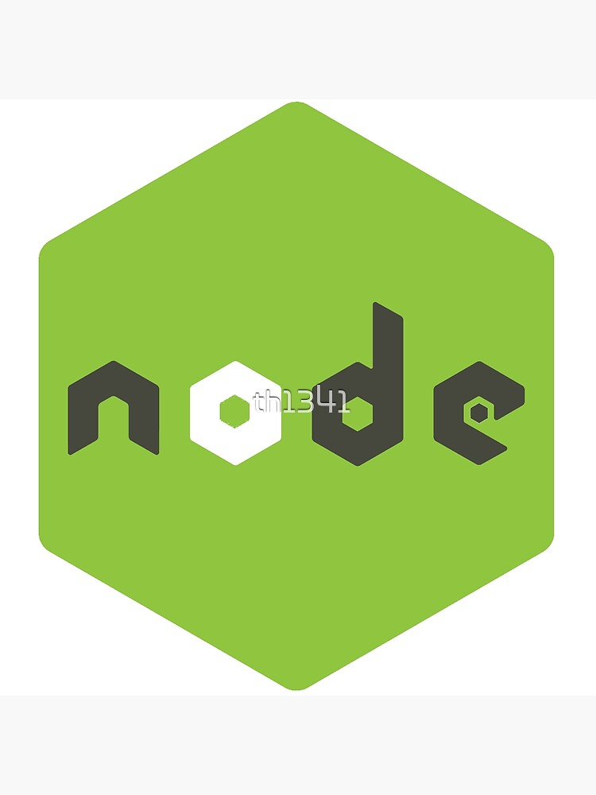
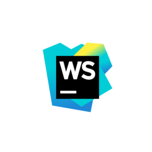
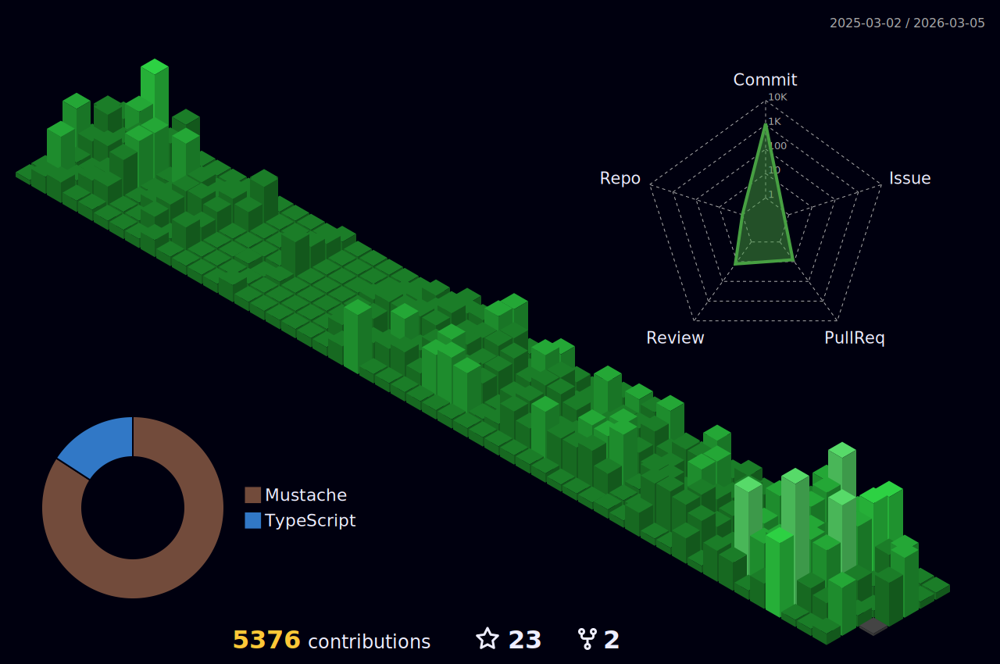

<!-- Social icons section -->
# Social Profiles:

<!-- Description about me -->
## 🤔 About me 👨‍💻

Hey there! 👋 I'm <b>Filip Bozhinovski</b>, but you may know me as <b>ssbarbee</b>.
Originating from the sunny realm of <b>Macedonia 🇲🇰🇲🇰</b>, I am enthusiastic about crafting innovative frontend solutions 🖥️.

However, I'm more than just a programming automaton 🤖. I'm an authentic individual driven by a passion to learn and create extraordinary projects with love ❤️, and in the process, I enjoy engaging with wonderful people on this journey 🚀.

If you're seeking someone with a positive attitude, a thirst for knowledge, and a dedication to continuous learning 📚, look no further. Feel free to reach out for collaboration on exciting new projects 📨; I'm always open to working together!

## 🧐 More About Me:

- 🔭 I’m currently working for Reya Labs [https://reya.xyz/](https://reya.xyz/)
- 🤝 I’m looking to collaborate on Open Source Projects
- 🌱 I’m currently learning NextJS, NestJS, PixiJS & Monkey C;
- 👨🏻‍💻 Most of my projects are available on [Github](https://github.com/ssbarbee?tab=repositories)
- 💬 Ask me about anything tech related, I am happy to help with Frontend stuff 🐧;
- 📫 Feel free to contact me on [LinkedIn](https://www.linkedin.com/in/filip-bozhinovski-306464122/)
- 👨‍💻 I am also on [StackOverflow!](https://stackoverflow.com/users/1861016/ssbarbee)
- 🏃 When I am free, I like jogging and doing half-marathons
- ♞ I also enjoy playing chess! You can find me over at [chess.com](https://www.chess.com/member/ssbarbe_e)

<!-- Skopje's weather table -->
## 🇲🇰 Skopje's Weather, if you want to visit! ⛅ Watch out on the pollution levels, it tends to get crazy!

<table>
    <tr>
        <th>Weather</th>
        <th>Temperature</th>
        <th>Sunrise</th>
        <th>Sunset</th>
        <th>Humidity</th>
        <th>Air quality (PM10)</th>
        <th>Air quality (PM25)</th>
    </tr>
    <tr>
        <td><b>Mainly clear, partly cloudy, and overcast</b></td>
        <td><b>4°C</b></td>
        <td><b>06:14</b></td>
        <td><b>16:20</b></td>
        <td><b>92%</b></td>
        <td><b>60 μg&#x2F;m3</b></td>
        <td><b>35 μg&#x2F;m3</b></td>
    </tr>
</table>

### Languages/Frameworks I'm great at:

    <code></code>
    <code></code>
    <code></code>
    <code></code>
    <code></code>
    <code></code>
    <code></code>
    <code></code>
    <code></code>
    <code></code>

### Languages/Frameworks I'm good at:

    <code></code>
    <code></code>
    <code></code>
    <code></code>

### Environments I work with:

    <code></code>
    <code></code>
    <code></code>

<!-- Github stats section -->
## 📊 Github stats

<!-- Based on: https://github.com/anuraghazra/github-readme-stats -->

     
    
    
     
    <b>Note:</b> Top languages is only a metric of the languages my public code consists of and doesn't reflect experience or skill level.

<!-- Projects section -->
## 📘 My top open source projects

<!-- Based on: Repo info cards - https://github.com/anuraghazra/github-readme-stats -->

    
    

&#8192;

    
    

&#8192;

    

&#8192;

&#8192;

    

<!-- last activity section -->

## Activity Graph

  

 

<!-- last refresh of readme section -->

Last refresh: <b>Thursday, November 7 at 2:26 AM GMT+1</b>

<!---
ssbarbee/ssbarbee is a ✨ special ✨ repository because its `README.md` (this file) appears on your GitHub profile.
You can click the Preview link to take a look at your changes.
--->
