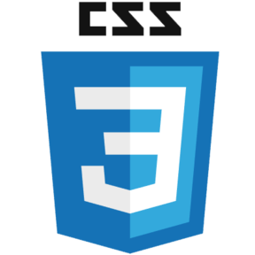
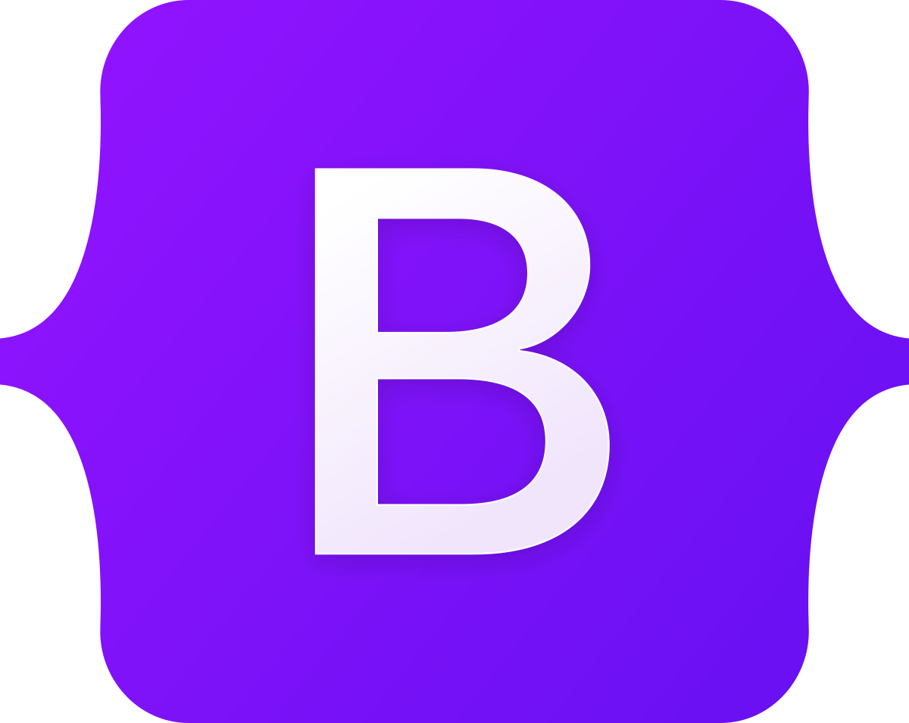
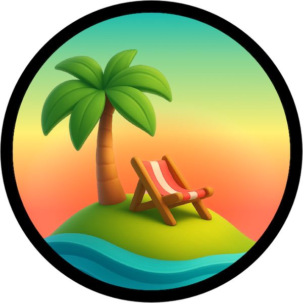
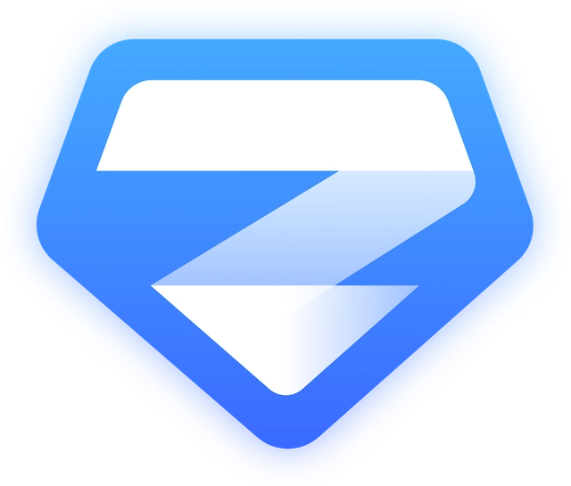
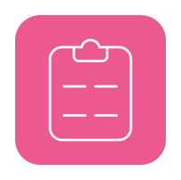
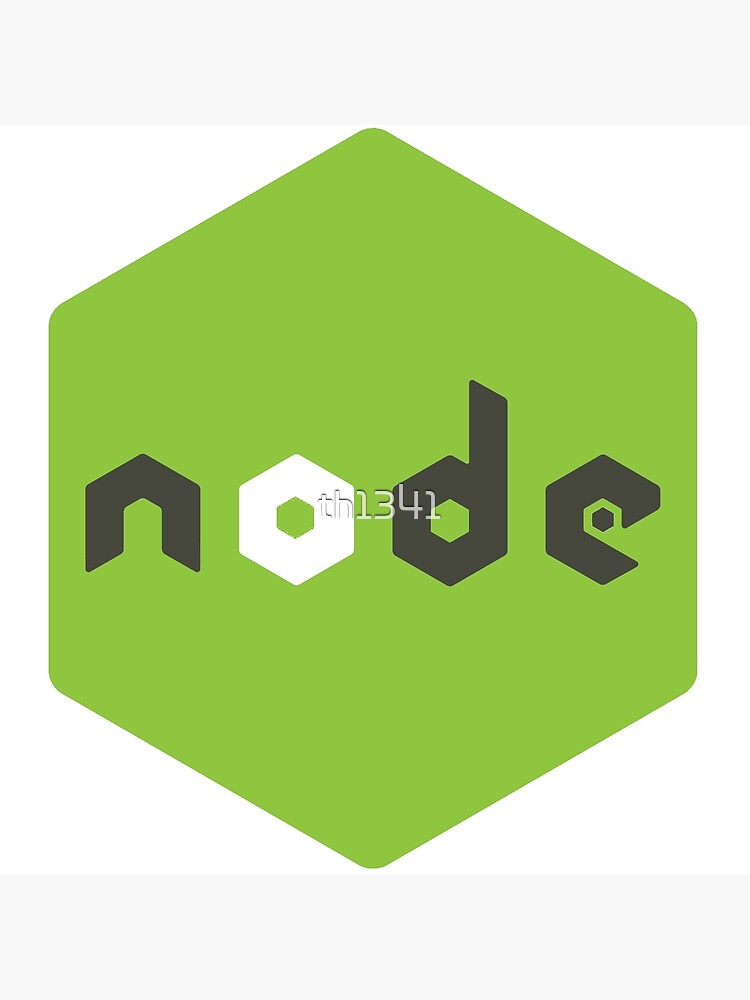
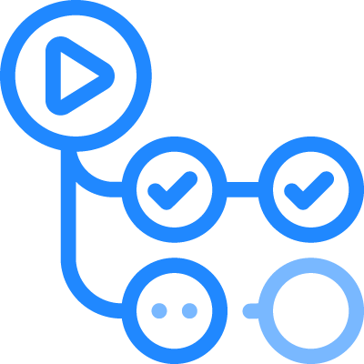
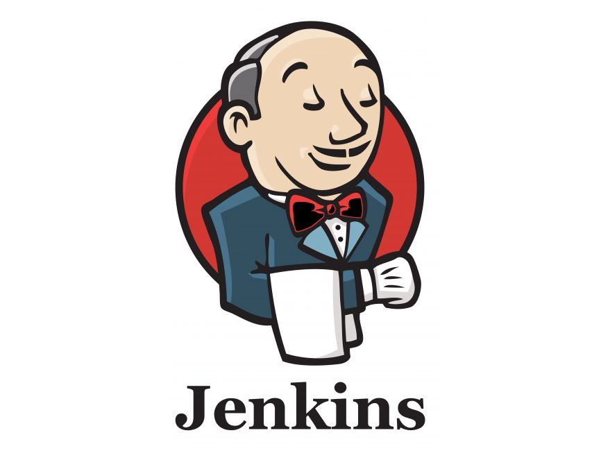
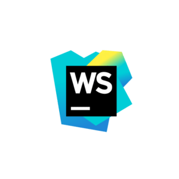

<!-- Cards in profile/light and profile/dark are rendered daily by src/cards; <picture> picks the one matching the viewer's GitHub theme. -->
<picture>
  <source media="(prefers-color-scheme: dark)" srcset="https://raw.githubusercontent.com/ssbarbee/ssbarbee/main/profile/dark/banner.svg">
  
</picture>

  
  
  
  

<table>
  <tr>
    <td width="50%" valign="top">
      <h3>About</h3>
      <ul>
        <li>Exploring AI/ML tooling and integrations</li>
        <li>Open to collaborating on open source</li>
        <li>Ask me anything frontend: React, TypeScript, Next.js</li>
        <li>Off the keyboard: half-marathons and <a href="https://www.chess.com/member/ssbarbe_e">chess</a></li>
      </ul>
    </td>
    <td width="50%">
      <picture>
        <source media="(prefers-color-scheme: dark)" srcset="https://raw.githubusercontent.com/ssbarbee/ssbarbee/main/profile/dark/skopje.svg">
        
      </picture>
    </td>
  </tr>
</table>

### Tech stack

  
  <a href="https://nextjs.org/"><picture><source media="(prefers-color-scheme: dark)" srcset="https://raw.githubusercontent.com/ssbarbee/ssbarbee/main/assets/nextjs.png"></picture></a>
  
  
  
  
  
  
  
  <a href="https://zustand-demo.pmnd.rs/"><picture><source media="(prefers-color-scheme: dark)" srcset="https://raw.githubusercontent.com/ssbarbee/ssbarbee/main/assets/zustand-dark.png"></picture></a>
  
  
  
  
  
  <a href="https://www.gnu.org/software/bash"><picture><source media="(prefers-color-scheme: dark)" srcset="https://raw.githubusercontent.com/ssbarbee/ssbarbee/main/assets/bash.png"></picture></a>
  
  
  
  
  <a href="https://github.com/"><picture><source media="(prefers-color-scheme: dark)" srcset="https://raw.githubusercontent.com/ssbarbee/ssbarbee/main/assets/github.png"></picture></a>
  
  

### GitHub stats

  <picture>
    <source media="(prefers-color-scheme: dark)" srcset="https://raw.githubusercontent.com/ssbarbee/ssbarbee/main/profile/dark/stats.svg">
    
  </picture>
  <picture>
    <source media="(prefers-color-scheme: dark)" srcset="https://raw.githubusercontent.com/ssbarbee/ssbarbee/main/profile/dark/top-langs.svg">
    
  </picture>
   
  Languages only cover my public code, not experience or skill level.

### Featured projects

<table>
  <tr>
    <td width="50%">
      <a href="https://github.com/ssbarbee/iap-apple"><picture><source media="(prefers-color-scheme: dark)" srcset="https://raw.githubusercontent.com/ssbarbee/ssbarbee/main/profile/dark/pin-iap-apple.svg"></picture></a>
    </td>
    <td width="50%">
      <a href="https://github.com/ssbarbee/react-metamask-avatar"><picture><source media="(prefers-color-scheme: dark)" srcset="https://raw.githubusercontent.com/ssbarbee/ssbarbee/main/profile/dark/pin-react-metamask-avatar.svg"></picture></a>
    </td>
  </tr>
  <tr>
    <td width="50%">
      <a href="https://github.com/ssbarbee/app-store-ratings"><picture><source media="(prefers-color-scheme: dark)" srcset="https://raw.githubusercontent.com/ssbarbee/ssbarbee/main/profile/dark/pin-app-store-ratings.svg"></picture></a>
    </td>
    <td width="50%">
      <a href="https://github.com/ssbarbee/pulse-eco-garmin-widget"><picture><source media="(prefers-color-scheme: dark)" srcset="https://raw.githubusercontent.com/ssbarbee/ssbarbee/main/profile/dark/pin-pulse-eco-garmin-widget.svg"></picture></a>
    </td>
  </tr>
</table>

### Contribution activity

<picture>
  <source media="(prefers-color-scheme: dark)" srcset="https://raw.githubusercontent.com/ssbarbee/ssbarbee/main/profile-3d-contrib/profile-night-green.svg">
  
</picture>

Refreshed daily by GitHub Actions · Last refresh: Tuesday, October 6 at 10:29 PM GMT+2

<!---
ssbarbee/ssbarbee is a ✨ special ✨ repository because its `README.md` (this file) appears on your GitHub profile.
You can click the Preview link to take a look at your changes.
--->
