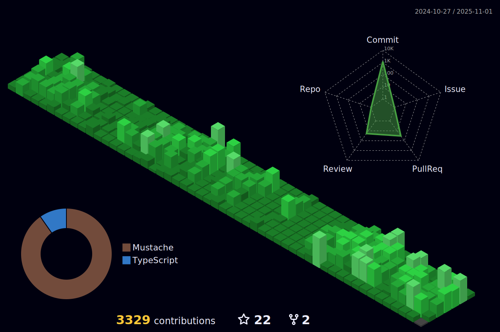

<!-- Social icons section -->
# Social Profiles:

<!-- Description about me -->
## 🤔 About me 👨‍💻

Hey there! 👋 I'm <b>Filip Bozhinovski</b>, but you may know me as <b>ssbarbee</b>.
Originating from the sunny realm of <b>Macedonia 🇲🇰🇲🇰</b>, I am enthusiastic about crafting innovative frontend solutions 🖥️.

However, I'm more than just a programming automaton 🤖. I'm an authentic individual driven by a passion to learn and create extraordinary projects with love ❤️, and in the process, I enjoy engaging with wonderful people on this journey 🚀.

If you're seeking someone with a positive attitude, a thirst for knowledge, and a dedication to continuous learning 📚, look no further. Feel free to reach out for collaboration on exciting new projects 📨; I'm always open to working together!

## 🧐 More About Me:

- 🤝 I'm looking to collaborate on Open Source Projects
- 🌱 I'm currently exploring AI/ML tooling and integrations
- 👨🏻‍💻 Most of my projects are available on [Github](https://github.com/ssbarbee?tab=repositories)
- 💬 Ask me about anything tech related, I am happy to help with Frontend stuff 🐧
- 📫 Feel free to contact me on [LinkedIn](https://www.linkedin.com/in/filip-bozhinovski-306464122/)
- 👨‍💻 I am also on [StackOverflow!](https://stackoverflow.com/users/1861016/ssbarbee)
- 🏃 When I am free, I like jogging and doing half-marathons
- ♞ I also enjoy playing chess! You can find me over at [chess.com](https://www.chess.com/member/ssbarbe_e)

<!-- Skopje's weather table -->
## 🇲🇰 Skopje's Weather, if you want to visit! ⛅ Watch out on the pollution levels, it tends to get crazy!

<table>
    <tr>
        <th>Weather</th>
        <th>Temperature</th>
        <th>Sunrise</th>
        <th>Sunset</th>
        <th>Humidity</th>
        <th>Air quality (PM10)</th>
        <th>Air quality (PM25)</th>
    </tr>
    <tr>
        <td><b>Mainly clear, partly cloudy, and overcast</b></td>
        <td><b>9°C</b></td>
        <td><b>06:36</b></td>
        <td><b>17:00</b></td>
        <td><b>75%</b></td>
        <td><b>19 μg&#x2F;m3</b></td>
        <td><b>13 μg&#x2F;m3</b></td>
    </tr>
</table>

### Frontend & UI:
<table>
  <tr>
    <td align="center" width="130" style="white-space: nowrap;"> React</td>
    <td align="center" width="130" style="white-space: nowrap;"> Next.js</td>
    <td align="center" width="130" style="white-space: nowrap;"> TypeScript</td>
    <td align="center" width="130" style="white-space: nowrap;"> JavaScript</td>
    <td align="center" width="130" style="white-space: nowrap;"> Tailwind</td>
    <td align="center" width="130" style="white-space: nowrap;"> HTML5</td>
    <td align="center" width="130" style="white-space: nowrap;"> CSS3</td>
    <td align="center" width="130" style="white-space: nowrap;"> Bootstrap</td>
  </tr>
</table>

### State Management & Data:
<table>
  <tr>
    <td align="center" width="130" style="white-space: nowrap;"> TanStack</td>
    <td align="center" width="130" style="white-space: nowrap;"> Zustand</td>
    <td align="center" width="130" style="white-space: nowrap;"> Zod</td>
    <td align="center" width="130" style="white-space: nowrap;"> Hook Form</td>
  </tr>
</table>

### Backend & DevOps:
<table>
  <tr>
    <td align="center" width="130" style="white-space: nowrap;"> Node.js</td>
    <td align="center" width="130" style="white-space: nowrap;"> NestJS</td>
    <td align="center" width="130" style="white-space: nowrap;"> GH Actions</td>
    <td align="center" width="130" style="white-space: nowrap;"> Bash</td>
    <td align="center" width="130" style="white-space: nowrap;"> Markdown</td>
  </tr>
</table>

### Also experienced with:
<table>
  <tr>
    <td align="center" width="130" style="white-space: nowrap;"> PixiJS</td>
    <td align="center" width="130" style="white-space: nowrap;"> C# / .NET</td>
    <td align="center" width="130" style="white-space: nowrap;"> Jenkins</td>
  </tr>
</table>

### Environments I work with:
<table>
  <tr>
    <td align="center" width="130" style="white-space: nowrap;"> GitHub</td>
    <td align="center" width="130" style="white-space: nowrap;"> NPM</td>
    <td align="center" width="130" style="white-space: nowrap;"> WebStorm</td>
  </tr>
</table>

<!-- Github stats section -->
## 📊 Github stats

<!-- Based on: https://github.com/stats-organization/github-readme-stats-action -->

     
    
    
     
    <b>Note:</b> Top languages is only a metric of the languages my public code consists of and doesn't reflect experience or skill level.

<!-- Projects section -->
## 📘 My top open source projects 

<table>
  <tr>
    <td width="50%">
      
    </td>
    <td width="50%">
      
    </td>
  </tr>
  <tr>
    <td width="50%">
      
    </td>
    <td width="50%">
      
    </td>
  </tr>
  <tr>
    <td width="50%">
      
    </td>
    <td width="50%"></td>
  </tr>
</table>

<!-- last activity section -->

## Activity Graph

  

 

<!-- last refresh of readme section -->

Last refresh: <b>Tuesday, February 10 at 4:56 PM GMT+1</b>

<!---
ssbarbee/ssbarbee is a ✨ special ✨ repository because its `README.md` (this file) appears on your GitHub profile.
You can click the Preview link to take a look at your changes.
--->
