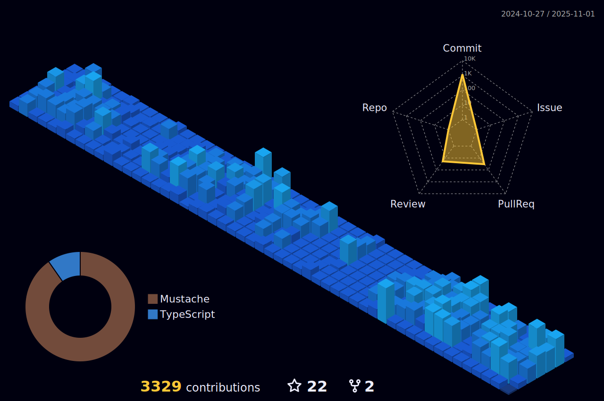

<!-- Social icons section -->
<h1 align="center"> Social Media: </h1>
  

    
<!--    <a href="https://google.com/">-->
<!--      -->
<!--    </a>-->
    
    
  

</h1>

<!-- Description about me -->
<h2 align="center"> 🤔 About me 👨‍💻 </h2>
Hey there! 👋 I'm <b>Filip Bozhinovski</b>, but you may know me as <b>ssbarbee</b>.
Originating from the sunny realm of <b>Macedonia 🇲🇰🇲🇰</b>, I am enthusiastic about crafting innovative frontend solutions 🖥️.

However, I'm more than just a programming automaton 🤖. I'm an authentic individual driven by a passion to learn and create extraordinary projects with love ❤️, and in the process, I enjoy engaging with wonderful people on this journey 🚀.

If you're seeking someone with a positive attitude, a thirst for knowledge, and a dedication to continuous learning 📚, look no further. Feel free to reach out for collaboration on exciting new projects 📨; I'm always open to working together!

<!-- Skopje's weather table -->
<h2 align="center"> 🇲🇰 Skopje's Weather ⛅ </h2>
<table align="center" style="width:50%">
    <tr style="text-align:center">
        <th>Weather</th>
        <th>Temperature</th>
        <th>Sunrise</th>
        <th>Sunset</th>
        <th>Humidity</th>
    </tr>
    <tr style="text-align:center">
        <td><b>few clouds</b></td>
        <td><b>6°C</b></td>
        <td><b>06:42 AM</b></td>
        <td><b>04:04 PM</b></td>
        <td><b>93%</b></td>
    </tr>
</table>

### 🧐 More About Me:
<table style="border: none;">
  <tr style="border: none;">
    <td style="border: none;">
      <ul>
        <li>
          🔭 I’m currently working for Voltz Labs
        </li>
        <li>
          🤝 I’m looking to collaborate on Open Source Projects
        </li>
        <li>
          🌱 I’m currently learning NextJS, NestJS & PixiJS;
        </li>
        <li>
          👨🏻‍💻 Most of my projects are available on (Github)[https://github.com/ssbarbee?tab=repositories]
        </li>
        <li>
          💬 Ask me about anything tech related, I am happy to help (if you have questions with linux you can ask me🐧);
        </li>
        <li>
          📫 Feel free to contact me on (LinkedIn)[https://www.linkedin.com/in/filip-bozhinovski-306464122/]
        </li>
        <li>
            🏃 When I am free, I like jogging and doing half-marathons
        </li>
    </td>
  </tr>
</table>
   

<h1 align="center"> Languages/Frameworks I'm great at: </h1>

    <code></code>
    <code></code>
    <code></code>
    <code></code>
    <code></code>
    <code></code>
    <code></code>
    <code></code>
    <code></code>

 

<h1 align="center"> Languages/Frameworks I'm good at: </h1>

    <code></code>
    <code></code>
    <code></code>

 

<h1 align="center"> Environments I work with: </h1>

    <code></code>
    <code></code>
    <code></code>

 

<!-- Github stats section -->
## 📊 Github stats

<!-- Based on: https://github.com/anuraghazra/github-readme-stats -->

     
    
    
     
    <b>Note:</b> Top languages is only a metric of the languages my public code consists of and doesn't reflect experience or skill level.

<!-- Projects section -->

## 📘 My top open source projects

<!-- Based on: Repo info cards - https://github.com/anuraghazra/github-readme-stats -->

    
    

&#8192;

    
    

&#8192;

&#8192;

    

<!-- last activity section -->

## Activity Graph

  

 

<!-- last refresh of readme section -->

Last refresh: <b>Friday, December 1 at 11:44 PM GMT+1</b>

<!---
ssbarbee/ssbarbee is a ✨ special ✨ repository because its `README.md` (this file) appears on your GitHub profile.
You can click the Preview link to take a look at your changes.
--->
